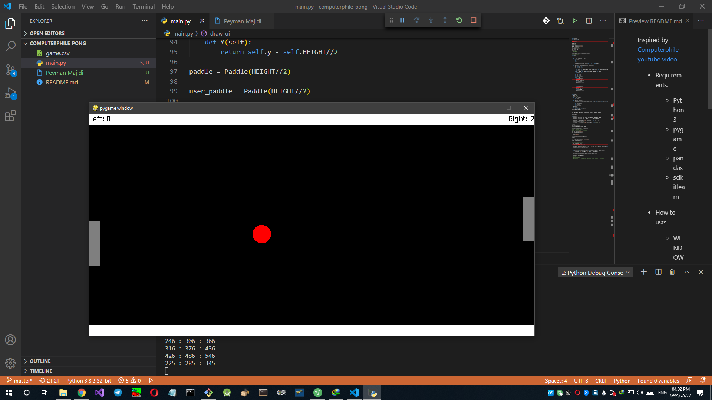

Inspired by [Computerphile youtube video](https://www.youtube.com/watch?v=JRLdbt7vK-E)

- Requirements:

    - Python3
    - pygame
    - pandas
    - scikitlearn
    
- How to use:
    
    - WINDOWS: `python main.py`
    - LINUX: `python3 main.py`
    - OSX: `python3 main.py`

